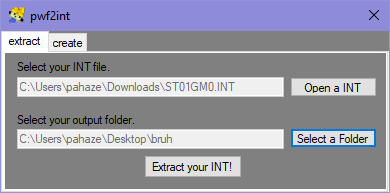
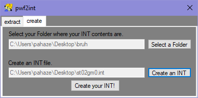

## Inserting your content into INT files (using pwf2tools)

[← Home](https://ptrguide.github.io)

Super easy to do. 

### Steps::

1. Get [pwf2tools.](https://github.com/pahaze/pwf2tools-cs/releases)

2. Have an extracted ISO ready.

3. Open pwf2tools, and go to pwf2int. Extract your INT as you normally would (do **NOT**  use hk0 INT files!).

4. Find the tutorial you want to use. If you're doing a hat edit, go read the [hat editing tutorial](https://ptrguide.github.io/hat-editing) (pwf2tools version is here!). If you're editing textures of a model, read [its tutorial.](https://ptrguide.github.io/edit-textures-of-models) 

5. Once you have edited your files with your INT, I would recommend backing it up first incase you did something wrong! It is very common to break INTs. Then, go to pwf2int and create an INT. Use the base INT folder you extracted! (Shows DATA, DATAS, etc). Create the INT as the stage you edited (example: if you edited stage 2, st02gm0.int). Should look like this!

6. Repackage your ISO with whatever app of choice! Then go to PCSX2 and use your new ISO. (I'd recommend backing up your original ISO or not overwriting it at all.)