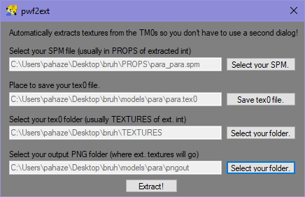
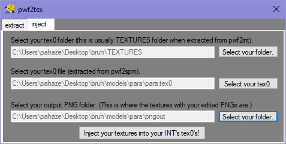

## Edit textures of models

[← Home](https://ptrguide.github.io)

#### What you need:

1. PCSX2 (https://pcsx2.net) 

2. Your legally obtained PTR2 ISO

3. [pwf2tools](https://ptrguide.github.io/pwf2tools-v12-beta2.zip)
 
### Step 1: Getting ready

Extract your INT. You'll need all the files in it beforehand.

Go to PROPS and choose a model.

Models are only named with the extension ".spm". Look for who you want. Names of the model's will be shortened usually, ex: parappa = para_para.spm.

I recommend making a new folder, as things get messy when editing models.

### Extracting using pwf2ext:

1. Open pwf2extract.

2. Fill out each box as it applies to you, save your TEX0 somewhere you'll remember. You'll need it. It should look a little something like this.

3. Click "Extract!" If you do not get any files, go to the bin folder of pwf2tools and run EACH exe once. (pwf2tex.exe, pwf2int.exe, pwf2spm.exe). Windows believes it's a threat sometimes since there's not a digital signature yet.

4. Edit your images in the folder and always remember to limit colors to 24 colors by image mode and then set image mode back to RGB. (Recommended to use GIMP if you're stuck using free software, as it is the first thing on the top of my head that I know can set image mode). Overwrite the original pngs too. They ***cannot*** be named something else than what they were before.

### Injecting:

11. Open pwf2tex and go to the "import" tab.

13. Fill in each box as it applies for you. Shoul look a lil like this.

14. Press "Inject!"

16. Once it's closed, go to pwf2int and repackage your INT (as long as you're ready or done editing, of course.)

