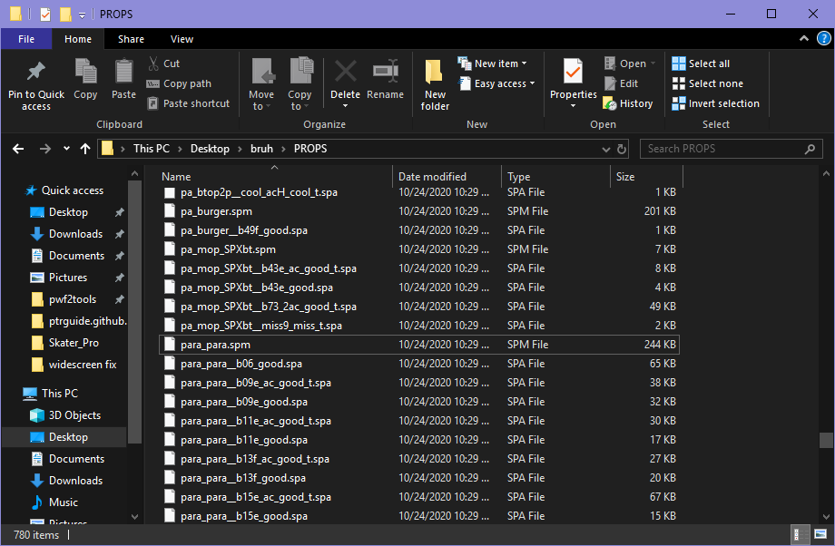
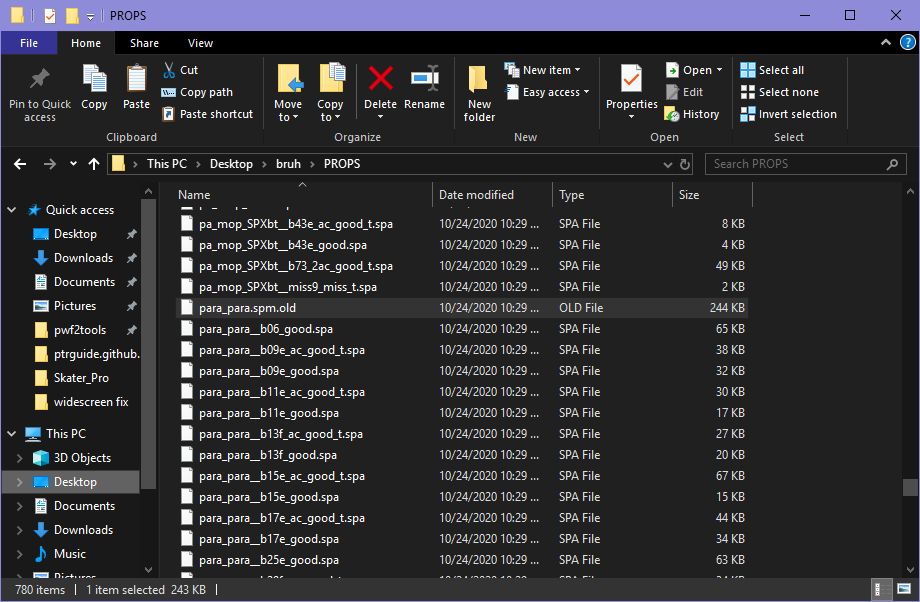
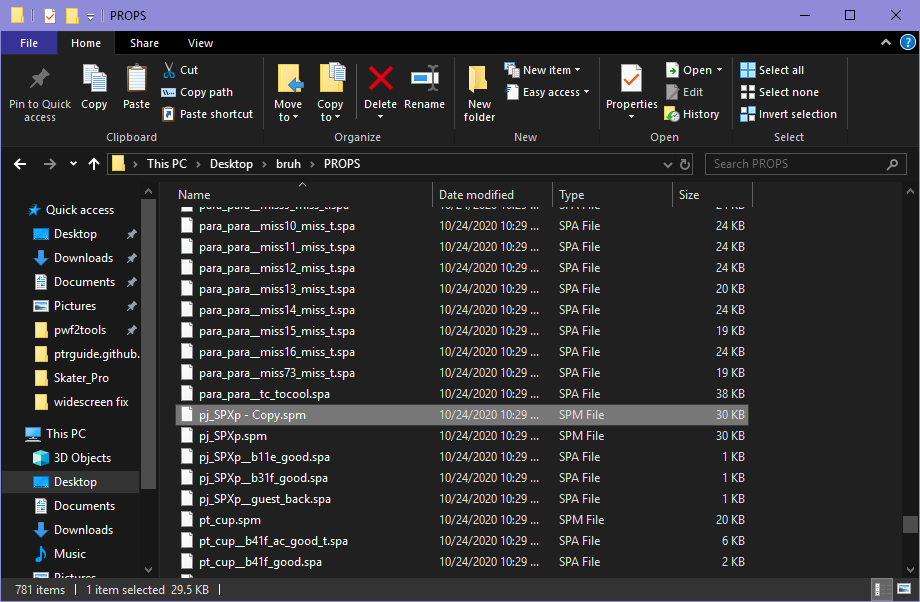
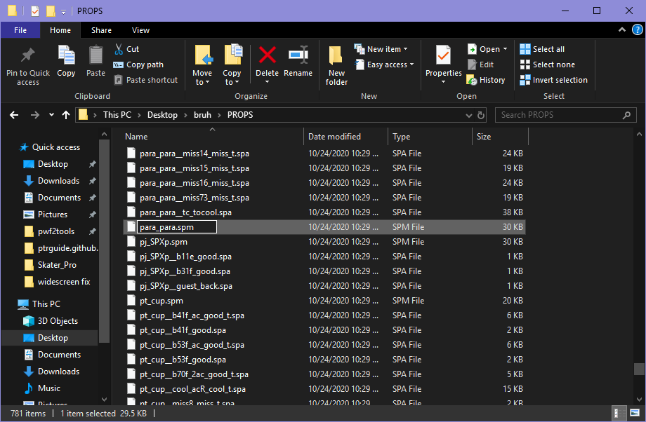
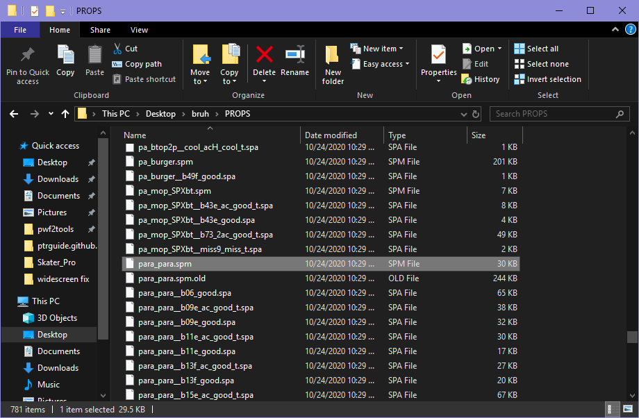

## Model Swapping

[← Home](https://ptrguide.github.io)

### Notes

- You need [pwf2tools](https://ptrguide.github.io/pwf2tools-v12-beta2.zip) or ptr2tools to extract and repackage your INT.

- [HxD](https://mh-nexus.de/en/hxd/) or any hex editor (for the safer way)

### Setting up:

When you get your INT extracted, all SPM files will be located in "INTDIR/PROPS".

You will want to make a backup of the model you are swapping, and you need to find each model. I will use stage 3 as an example. Parappa's model is para_para.spm.

### Replacing original model (the safe way):

Open up both the model you want to replace and the one you are replacing it with.

You CANNOT change the first 5 lines of the model, otherwise it will BREAK it! On the model you are replacing it with, go to Edit > Select Block. Starting offset will be 00000050, ending offset will be FFFFFFFF. Click ok. Copy it with CTRL+C. If you get an error about the clipboard, ignore it. It should look like this!

Now go to your other model (the one you ARE replacing), and do the same block. This time, press CTRL+V to paste instead! Then save it. You don't have to do anything else with either model.
Finish off by inserting it into your INT file and repackaging it.

### Replacing original model (the less safe way):

Simply rename the model you want to replace and then copy your other model over it.

There's no need to worry about the INT being too big or small, it will automatically add only the files it needs.